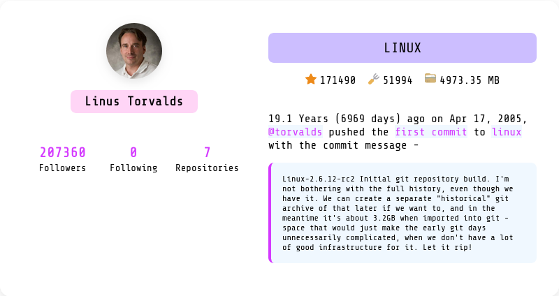

<h1 align="center"></h1>

__Overview__

The idea came to me while I was watching an Instagram reel where the guy was showing the first commit on the __[Git](https://github.com/git/git)__, which was done using `git` itself. I don't remember the specifics. No one remembers the content of a 15-second reel, especially if they're writing about it weeks later. Never mind.

The project relies on the GitHub API but not on API keys. The search *might* seem slow because we apply a `600ms` debounce to avoid bombarding requests with every keystroke you search for. It's a bummer, but it works flawlessly.

__Contributing__

Contributions are welcome! If you find any issues or have suggestions for improvements, please open an issue or submit a pull request.

__License__

Project is licensed under the [MIT License](LICENSE).
